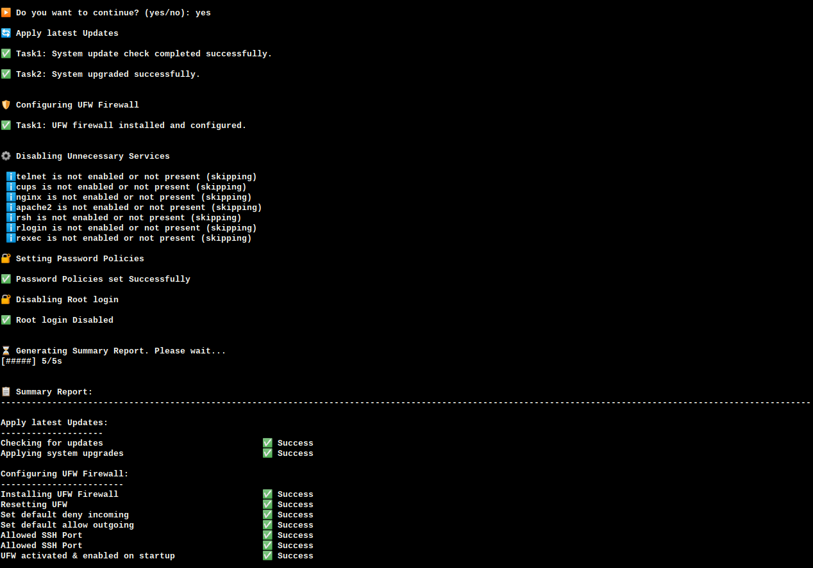

## NixVault - Linux security hardening tool
<div style="display: flex; align-items: center;">
    
    <p>NixVault is a comprehensive Linux security hardening tool designed to safeguard your system from internal vulnerabilities and external threats. Built with a focus on simplicity and power, NixVault automates best-practice configurations, manages sensitive data securely, and reinforces system integrity.</p>
</div>

```
  _   _ _    __      __         _ _   
 | \ | (_)   \ \    / /        | | |  
 |  \| |___  _\ \  / /_ _ _   _| | |_ 
 | . ` | \ \/ /\ \/ / _` | | | | | __|
 | |\  | |>  <  \  / (_| | |_| | | |_ 
 |_| \_|_/_/\_\  \/ \__,_|\__,_|_|\__|
 
 NixVault - Created by Aswin KS 

```
---

## 📦 Features

- 🔄 Apply latest system updates
- 🛡️ Configure UFW firewall with  secure settings
- ⚙️ Disable insecure or unused services like Telnet, rsh, etc.
- 🔐 Enforce user account security policies (e.g., password aging)
- ✨ SSH Security Hardening Configurations
- 📁 Filesystem Security Hardening including setting permissions.
- 💾 Backing up Important Configuration Files
- 📄 Generate a clear summary report of each operation
- ✅ Gracefully handles Ctrl+C interruptions
- 📝 Log file integration to easily review errors and logs
- 💡 Modular structure with easy extensibility
- 🐍 Built using Python

Note: Software is in development stage

---
## 🚀 Getting Started

### 1. Prerequisites

- Python 3.6+
- Linux system (tested on Ubuntu)
- Root/sudo privileges
- Internet connection (for updates)

### 2. Installation

```bash
git clone https://github.com/aswinks123/NixVault
cd NixVault
sudo python3 nixVault.py
```
Note: This program is set up to run only with sudo or root privilages

## Modules Overview


### 🔄 System Updates

Updates all system packages

Configures automatic security updates

### 🛡️ Firewall Configuration

Enables UFW firewall

Sets default deny policies

Allows only SSH (customizable)

### ⚙️ Service Hardening

Disables legacy services (telnet, rsh, rlogin)

Removes insecure protocols (FTP, NFSv3)

Secures common services (NTP, cron)

### ✨ SSH Hardening

Disables root login

Enforces key-based authentication

Sets secure protocol and cipher settings

Configures idle timeout

### 📁 Filesystem Protection

Sets secure permissions on critical files

### 🔐 User Account Policies

Enforces password complexity

Sets password aging

### 📝 Logging & Reporting

Detailed logs in /logs/result.log

Summary report displayed at completion

Backup of modified files in ~/config_backups/

### ✅ Security Considerations

Always test in a non-production environment first

Review changes before applying

Ensure you have backup access (console) in case of SSH lockout

### 🤝 Contributing

Pull requests welcome! Please:

Fork the repository

Create your feature branch

Commit your changes

Push to the branch

Open a pull request

### 📜 License

MIT License - See LICENSE file for details

### Demo


### Sample screenshot




