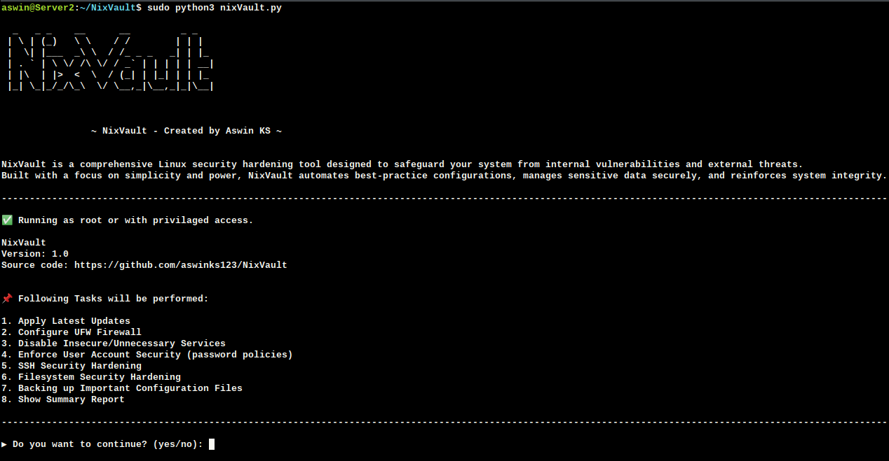

## NixVault - Linux security hardening tool
<div style="display: flex; align-items: center;">
    
    <p>NixVault is a comprehensive Linux security hardening tool designed to safeguard your system from internal vulnerabilities and external threats. Built with a focus on simplicity and power, NixVault automates best-practice configurations, manages sensitive data securely, and reinforces system integrity.</p>
</div>

```
  _   _ _    __      __         _ _   
 | \ | (_)   \ \    / /        | | |  
 |  \| |___  _\ \  / /_ _ _   _| | |_ 
 | . ` | \ \/ /\ \/ / _` | | | | | __|
 | |\  | |>  <  \  / (_| | |_| | | |_ 
 |_| \_|_/_/\_\  \/ \__,_|\__,_|_|\__|
 
 NixVault - Created by Aswin KS 

```
---

## 📦 Features

- 🔄 Apply latest system updates
- 🛡️ Configure UFW firewall with default secure settings
- ⚙️ Disable insecure or unused services like Telnet, rsh, etc.
- 🔐 Enforce user account security policies (e.g., password aging, root SSH disable)
- 📄 Generate a clear summary report of each operation
- ✅ Gracefully handles Ctrl+C interruptions
- 💡 Modular structure with easy extensibility

---
## 🚀 Getting Started

### 1. Clone the Repository

```bash
git clone https://github.com/aswinks123/NixVault
cd NixVault
sudo python3 nixVault.py
```
Note: This program is set up to run only with sudo or root privilages

Sample screenshot





