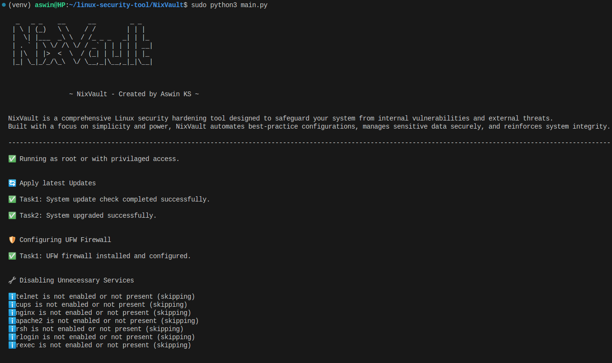

# NixVault
NixVault is a comprehensive Linux security hardening tool designed to safeguard your system from internal vulnerabilities and external threats. Built with a focus on simplicity and power, NixVault automates best-practice configurations, manages sensitive data securely, and reinforces system integrity.

 _   _ _    __      __         _ _   
 | \ | (_)   \ \    / /        | | |  
 |  \| |___  _\ \  / /_ _ _   _| | |_ 
 | . ` | \ \/ /\ \/ / _` | | | | | __|
 | |\  | |>  <  \  / (_| | |_| | | |_ 
 |_| \_|_/_/\_\  \/ \__,_|\__,_|_|\__|

 
To run the program:

sudo python3 main.py

Note: This program is set up to run only with sudo or root privilages

Sample screenshot

